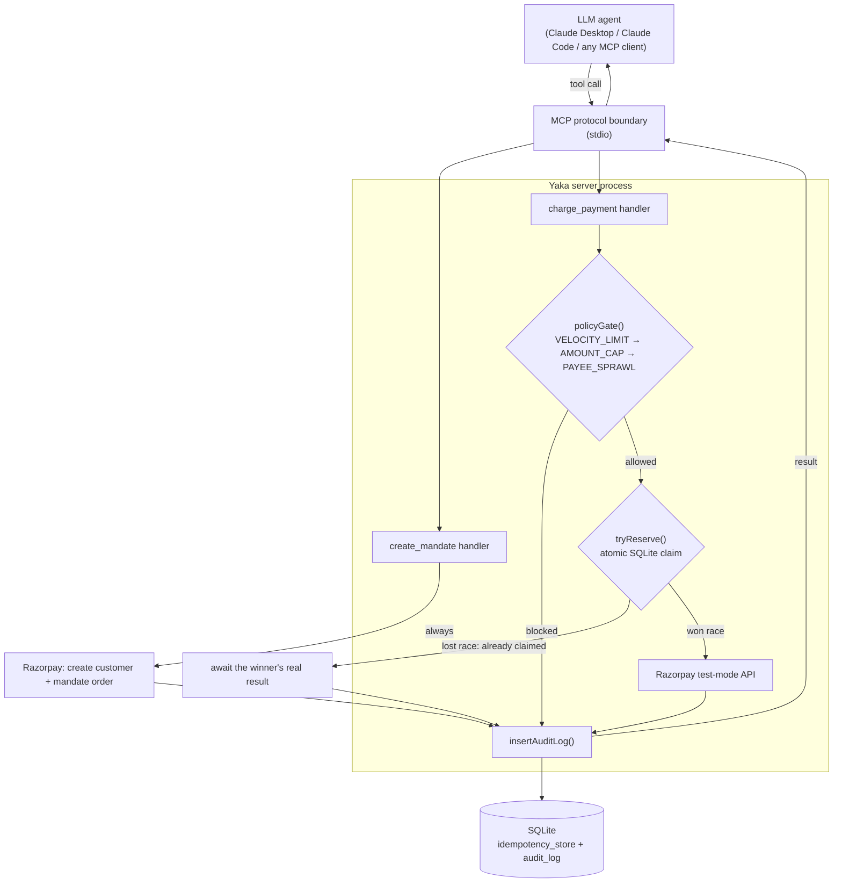

# Yaka — developer documentation

This is the "read this before you tell anyone about it" doc — a plain-language
walkthrough of what was actually built, why it's shaped this way, what's
genuinely proven vs. what's a known limitation, and the two real bugs that
got found and fixed along the way. The `README.md` in this folder is the
public-facing pitch; this file is the honest internal one.

## 1. What this actually is

An MCP (Model Context Protocol) server. That means: it's a program that
exposes a small set of "tools" — in this case exactly two — that any MCP
client (Claude Desktop, Claude Code, or any other MCP-compatible LLM
agent) can call. The two tools wrap Razorpay's payment API:

- `create_mandate` — registers a recurring-payment mandate (eNACH or UPI
  Autopay) with Razorpay.
- `charge_payment` — charges money against an existing mandate.

The point of the project isn't "an LLM can now pay people" — plenty of
things can call a payment API. The point is: **an LLM agent using this
server physically cannot skip the safety checks**, no matter what it's
told to do, because the checks aren't something it could choose to skip
in the first place.

## 2. The core architecture decision, explained properly

A common (weak) pattern for "AI safety" in agent tooling looks like this:

```
Tools exposed: check_spending_limit, charge_payment
```

An LLM agent is *supposed* to call `check_spending_limit` before
`charge_payment`. But "supposed to" is a prompt-level convention, not an
enforced rule. A confused agent, a prompt injection, a badly-written
system prompt, or just an LLM cutting a corner under time pressure can
call `charge_payment` directly and skip the check entirely. The check
exists, but it's optional in practice.

This project does not expose a `check_spending_limit` tool at all. There
is no tool call that represents "the decision to check." The check runs
**inside** `charge_payment`'s own handler, unconditionally, before a single
line of Razorpay-calling code executes. From the LLM's point of view,
calling `charge_payment` and having it get blocked isn't a check it
failed to run — it's just what that tool does sometimes. There is no
alternate code path that reaches Razorpay without going through the gate
first. See `src/tools/chargePayment.ts` — the gate call is the literal
first line of the function body.

## 3. System diagram



## 4. File-by-file walkthrough

**`src/index.ts`** — the MCP server entrypoint. Registers the two tools
with the SDK, wires each one's Zod input schema, starts a stdio
transport. This file has zero business logic — it's pure protocol
plumbing. One operational rule worth remembering: **never `console.log`
here** (or in anything it imports at startup) — stdout *is* the MCP
protocol channel; a stray log line would corrupt every message after it.
Use `console.error` for anything you want visible in a terminal.

**`src/tools/chargePayment.ts`** — the interesting file. Implements the
exact four-step contract from the spec:
1. `policyGate(input)` — if blocked, return the refusal and stop. Nothing
   below this line runs.
2. `tryReserve(hash)` — atomically claim this exact `(payeeId, amount,
   mandateId, purpose)` combination. See §6 for why this has to be atomic.
3. If we won the reservation: actually call Razorpay, store whatever
   comes back (success or error).
4. Log the attempt either way.

**`src/tools/createMandate.ts`** — simpler: no policy checks (mandates
don't move money by themselves), just call Razorpay and log the attempt.

**`src/policyGate.ts`** — the three checks, in the exact order the spec
requires (velocity, then amount, then payee sprawl). Pure functions —
given an input and the current state of `audit_log`, deterministically
returns allow/block. No side effects, easy to reason about.

**`src/db.ts`** — the only file that touches SQLite. Two tables:
`idempotency_store` (the dedupe mechanism) and `audit_log` (the full
history). Also computes "today's spend" and "today's distinct payees" for
the policy gate — see §6 for the subtlety there.

**`src/razorpay.ts`** — the only file that talks to the actual Razorpay
API. Deliberately "dumb" — it doesn't know about policy checks or
idempotency, just how to shape a correct request and how to pull a real
error message out of Razorpay's error objects (see §7).

**`demo-attack.ts`** — not part of the server. A separate script that
plays the role of a misbehaving agent: spawns its own instance of the
server (exactly like a real MCP client would) and fires the four attack
scenarios from the spec at it.

## 5. What's actually proven vs. what isn't

**Proven, with real evidence, not just "should work":**
- The policy gate blocks before Razorpay is ever called (confirmed live,
  both via `demo-attack.ts` and via an actual Claude Desktop conversation
  where a ₹15,000 charge against a ₹5,000 daily cap was blocked with a
  clear reason and zero Razorpay calls made)
- Idempotency holds under real concurrency, not just sequential retries —
  5 identical charges fired *simultaneously* result in exactly 1 real
  Razorpay attempt
- `create_mandate` with `method: "upi_autopay"` creates a real customer
  and a real mandate order in Razorpay's sandbox
- The audit log accurately reflects every attempt, in the exact schema
  the spec asked for

**Not proven — and here's exactly why, which matters for how you talk
about this:**
- A genuinely *successful* charge against a mandate. Razorpay's real
  recurring-payment charge requires a `token_id` that only exists after
  a customer completes authorization in their bank/UPI app — a step that
  fundamentally cannot be scripted headlessly. This isn't a gap in the
  implementation; it's a property of how mandate-based payments actually
  work. The charge code path is real and correctly shaped (verified
  against Razorpay's own documented request format); it gets a real
  rejection from Razorpay in response, which is exactly what should
  happen without an authorized token.
- `create_mandate` with `method: "emandate"` — consistently fails with a
  generic `SERVER_ERROR` (HTTP 502, `source: "internal"`) even when using
  Razorpay's own documented example values verbatim, retried across
  multiple attempts. This has the same signature as a different issue
  found earlier in this Razorpay sandbox account (refunds were similarly
  blocked with a generic error) — almost certainly an account-level
  feature that isn't activated for this test account, not a bug in the
  code. **Lead your demo with `upi_autopay`, which works end to end.**

## 6. Bug #1: the idempotency race condition (and why it's worth mentioning in your pitch)

The first version of `chargePayment.ts` did this:
1. Look up whether this intent hash already has a cached result.
2. If not, call Razorpay (an `await` — async, takes real time).
3. Store the result.

This looks reasonable and is a common pattern. It's also broken under
concurrency. When `demo-attack.ts` fired 5 identical charges via
`Promise.all` (genuinely simultaneously, not one after another), all 5
executions reached step 1 and found nothing cached — because none of the
5 had reached step 3 yet. Result: all 5 called Razorpay for real. The
"only 1 real call" property the spec explicitly asks to demonstrate was
silently broken.

The fix: replace "look up, then later store" with a single atomic
operation — `INSERT INTO idempotency_store (...) VALUES (...) ON CONFLICT
DO NOTHING`, checking whether the insert actually happened
(`result.changes === 1`). Because `better-sqlite3` executes synchronously,
this one statement can't be interleaved with another call's `await` —
exactly one caller can ever "win" the reservation for a given hash.
Callers that lose the race wait for the winner's real result
(`awaitIdempotentResult`, a short poll loop) instead of getting an
ambiguous "try again" response.

This is worth stating explicitly if anyone asks about this project's
robustness: the naive version of idempotency looked correct in casual
testing (fire one request, see it work) and only broke under real
concurrent load — which is exactly the scenario `demo-attack.ts` was
designed to catch, and did.

## 7. Bug #2: mandate creation had the amount backwards

Razorpay's mandate/authorization order API is unintuitive on first read:
the order's own `amount` field is *not* the mandate's spending cap — that
lives entirely in `token.max_amount`. The order-level `amount` instead
represents what gets charged *right now*, during registration, which per
Razorpay's docs must be `0` for eMandate and a nominal ₹1 minimum for UPI
Autopay. The first version of `createRazorpayMandate` passed the mandate's
real cap as the order's top-level `amount`, which Razorpay correctly
rejected. Fixed by looking up Razorpay's actual documented example
request bodies rather than guessing from the field name.

A second, smaller bug surfaced while fixing the first one: the synthetic
customer contact/email was fully deterministic from `payeeId`, so calling
`create_mandate` twice for the same payee tried to create the same
customer twice. Razorpay's own Node SDK has a confirmed bug
([razorpay/razorpay-node#381](https://github.com/razorpay/razorpay-node/issues/381))
where its `fail_existing: 0` option (meant to return the existing
customer instead of erroring) doesn't reliably work. Rather than working
around a confirmed third-party SDK bug, the fix makes the synthetic
contact unique per call — sidesteps the collision entirely.

## 8. If you want to extend this

- **A real authorization flow**: would need a checkout/redirect step for
  the customer to approve the mandate in their bank/UPI app, then a
  webhook to receive the resulting `token_id`. Out of scope for this
  hackathon slice on purpose (see spec: "no webhook handling beyond
  what's needed for the charge to complete in test mode").
- **More policy checks**: add a case to `policyGate.ts` — it's a pure
  function, easy to extend, easy to unit test in isolation.
- **A real approval/human-in-the-loop flow**: explicitly out of scope per
  the original spec, but architecturally it would slot in as a fourth
  gate check that returns a "pending approval" state instead of
  allow/block, with a separate tool or channel to actually approve.

## 9. Operational notes

See `README.md` for the actual setup/run commands. One thing worth
knowing that isn't obvious: **Claude Desktop runs the compiled `dist/`
output, not the TypeScript source** — `npm run build` after any source
change, then fully restart Claude Desktop (quit, not just close the
window), or it keeps running the old code.
