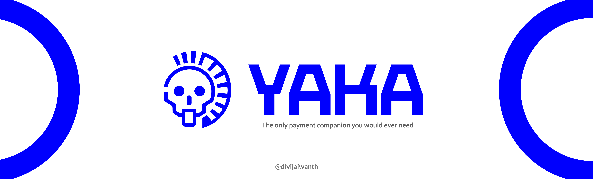
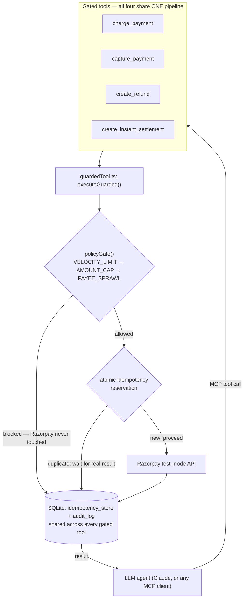
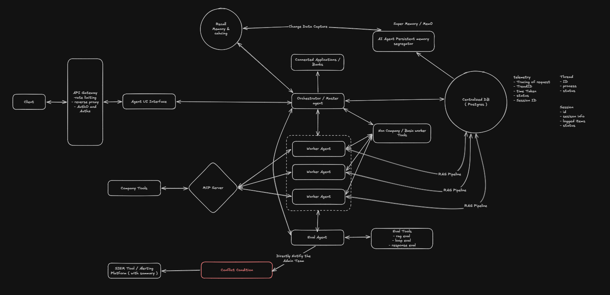

<p align="center">
  
</p>

# Yaka

**A safety layer for agentic payments that an LLM cannot talk its way
around.**

Yaka is an [MCP](https://modelcontextprotocol.io) server that puts a
single, unbypassable policy layer in front of every Razorpay operation
that moves money. Not just one flow — charging a mandate, capturing a
payment, issuing a refund, settling your balance all go through the
**same** enforcement pipeline: a shared daily spending cap, a
per-transaction cap, a distinct-payee limit, and duplicate-call
protection, all checked *before* Razorpay is ever contacted. Point any
MCP-compatible agent (Claude Desktop, Claude Code, or your own) at this
server, and every payment action it can take is gated the same way — the
agent doesn't get to choose which of its tool calls are "safe" ones.

## The problem this solves

The common pattern for "AI safety" in agent tooling is a separate
`check_limits` tool that the agent is *supposed* to call before
`charge_payment`. That's a convention, not a rule — a confused agent, a
bad prompt, or a prompt injection can call `charge_payment` directly and
the check never runs. It exists, but it's optional in practice.

## What's different here

The safety checks are not a tool. There is no `check_spending_limit` tool
to skip, because the check isn't a decision point at all — it's code that
runs unconditionally at the top of *every* gated tool's handler, before a
single line of Razorpay-calling code executes. There is no path from
"agent calls a payment tool" to "money moves" that doesn't pass through
the gate first — and it's the same gate and the same shared spending
tracking for all of them, not a separate check bolted onto each one. See
[`DEV_DOCS.md`](./DEV_DOCS.md) for the full architecture writeup,
including real bugs found by actually running the thing under load, not
just written and assumed correct.

**In short, what makes this project worth a second look:**
- **Enforcement, not convention** — the gate is unconditional middleware
  inside every gated tool's handler, not an optional tool the LLM can be
  persuaded to skip
- **A real policy layer, not a per-tool patch** — `charge_payment`,
  `capture_payment`, `create_refund`, and `create_instant_settlement` all
  route through the same shared pipeline (`guardedTool.ts`) and the same
  daily cap. An agent can't dodge the limit by moving money through a
  different tool call.
- **The gate is deterministic code, not an LLM call** — a check that can
  block real money movement should never be a probabilistic judgment.
  There's no model in the loop deciding whether to allow a charge; it's
  plain, auditable, unit-testable TypeScript. The LLM decides *what* to
  attempt; it never gets a vote on whether the attempt is *allowed*.
- **Real Razorpay integration, not mocked** — every call in this repo is
  a genuine Razorpay test-mode API call, including the ones that reveal
  real-world constraints (see [Known limitations](#known-limitations))
- **Concurrency-safe idempotency** — verified under actual simultaneous
  duplicate calls, not just sequential retries (this is the part most
  "add idempotency" implementations get subtly wrong — see `DEV_DOCS.md` §6)
- **MCP-native** — not tied to one agent framework; anything that speaks
  MCP (Claude, or any other MCP client) gets the same protection for free
- **A full, queryable audit trail from the first tool call**, not bolted
  on afterward

## Architecture



`create_mandate` isn't in this diagram — it registers a mandate but
doesn't move money by itself, so it isn't gated (still audit-logged,
just not spend-limited).

## Tools exposed

| Tool | Purpose | Counterparty tracked? |
|---|---|---|
| `create_mandate` | Register an eNACH or UPI Autopay mandate with a payee | — (not gated; mandates don't move money by themselves) |
| `charge_payment` | Charge against an existing mandate | Yes — the payee |
| `capture_payment` | Confirm an already-authorized payment | No — your own payment, not a new party |
| `create_refund` | Refund a payment back to whoever paid it | No — returns money, doesn't pay a new party |
| `create_instant_settlement` | Settle your balance to your own bank account | No — your own account |

Every tool except `create_mandate` routes through the **same** gate and
the **same** shared daily-spend tracking — see `src/guardedTool.ts`.

### Policy gate (every gated tool)

Checked in this exact order, configurable via environment variables:

All amounts are in **paise** (Razorpay's smallest currency unit) — an agent
converting a user's "₹500" into `50000` is correct and expected, so set
these thresholds in paise too.

1. **`VELOCITY_LIMIT`** — today's spend for this agent **across every
   gated tool combined** + this amount > `DAILY_CAP` (default `2500000` = ₹25,000)
2. **`AMOUNT_CAP`** — this amount alone > `SINGLE_TXN_CAP` (default `1000000` = ₹10,000)
3. **`PAYEE_SPRAWL`** — only for tools with a counterparty (see table
   above): this would be a new distinct counterparty beyond `MAX_PAYEES`
   paid today, across every gated tool (default `3`)

A blocked call returns a structured refusal and touches nothing else:

```json
{ "allowed": false, "code": "VELOCITY_LIMIT", "reason": "Today's spend across all payment tools (500) + this amount (5001) would exceed the daily cap of 5000" }
```

The unification is real, not just a claim — `demo-attack.ts` proves it: a
`capture_payment` call gets blocked by spend that a *different* tool
(`charge_payment`) already accumulated earlier the same day.

## Dependencies

| Package | Why |
|---|---|
| [`@modelcontextprotocol/sdk`](https://www.npmjs.com/package/@modelcontextprotocol/sdk) | MCP server + client implementation |
| [`razorpay`](https://www.npmjs.com/package/razorpay) | Official Razorpay Node SDK |
| [`better-sqlite3`](https://www.npmjs.com/package/better-sqlite3) | Synchronous SQLite — no external database needed, and its synchronicity is what makes the idempotency reservation atomic (see `DEV_DOCS.md`) |
| [`zod`](https://www.npmjs.com/package/zod) | Tool input schema validation |
| [`dotenv`](https://www.npmjs.com/package/dotenv) | Loads `.env` |
| `tsx`, `typescript` (dev only) | Run/compile TypeScript directly |

Node.js 20+ (uses `node --import` for running TypeScript without a build
step). No Docker, no external database, no paid services.

## Setup

```bash
npm install
cp .env.example .env
```

Fill in `.env`:

```bash
RAZORPAY_KEY_ID=          # from your Razorpay test-mode dashboard
RAZORPAY_KEY_SECRET=      # from your Razorpay test-mode dashboard
DAILY_CAP=2500000         # paise (= ₹25,000/day across ALL payment tools)
SINGLE_TXN_CAP=1000000    # paise (= ₹10,000 per transaction)
MAX_PAYEES=3              # distinct payees per day
DB_PATH=./data/guardrail.db   # optional, this is the default
```

## Usage

**Run the demo** (the fastest way to see it work — no external client
needed):

```bash
npm run demo-attack
```

Spawns its own server instance (identical to how a real MCP client would
launch it) and simulates a misbehaving agent:
- fires an identical charge 5x rapidly → only 1 real Razorpay attempt, the rest served from the deduped result
- attempts a charge over `DAILY_CAP` → blocked, `VELOCITY_LIMIT`, zero Razorpay calls
- attempts charges to more payees than `MAX_PAYEES` allows → blocked on the one that crosses the line, `PAYEE_SPRAWL`
- attempts a *different* tool (`capture_payment`) that alone would fit under `DAILY_CAP`, but not on top of what `charge_payment` already spent that day → blocked too, proving the cap is shared across tools, not tracked per-tool
- prints the full audit log so every decision is visible and explainable

**Reset demo state** between runs (clears today's spend/payee tracking
without waiting for a new day or restarting anything):

```bash
npm run reset
```

**Run the server standalone**, to point a real MCP client at it:

```bash
npm start
```

**Connect it to Claude Desktop or Claude Code** — add to Claude Desktop's
`claude_desktop_config.json` (or register via `claude mcp add` for Claude
Code):

```json
{
  "mcpServers": {
    "yaka": {
      "command": "node",
      "args": ["/absolute/path/to/this/repo/dist/src/index.js"],
      "env": {
        "RAZORPAY_KEY_ID": "...",
        "RAZORPAY_KEY_SECRET": "...",
        "DAILY_CAP": "5000",
        "SINGLE_TXN_CAP": "2000",
        "MAX_PAYEES": "3",
        "DB_PATH": "/absolute/path/to/this/repo/data/guardrail.db"
      }
    }
  }
}
```

Run `npm run build` first — Claude Desktop spawns MCP servers outside a
normal shell, so it needs the compiled `dist/` output and absolute paths;
it can't resolve `tsx` or relative paths the way a terminal can. Rebuild
and fully restart Claude Desktop after any source change.

Then, in conversation:

> Use yaka to create a UPI Autopay mandate for payee "acme-vendor",
> amount 1500, purpose "monthly subscription"

> Charge 15000 against that mandate for payee "acme-vendor"

— watch it get blocked by the policy gate before Razorpay is ever
touched, with a clear, structured reason. Then try a **different** tool
and watch the **same** daily cap apply:

> Now capture payment pay_XXXXXXXX for 4000

If the mandate charge above already used up most of today's cap, this
gets blocked too — same limit, different tool call.

## Known limitations

- **A genuinely successful charge requires a customer-authorized
  mandate.** Real eNACH/UPI Autopay charges need a `token_id` that only
  exists after the customer approves the mandate in their bank/UPI
  app — a step that can't be scripted headlessly. `charge_payment` makes
  a real, correctly-shaped call to Razorpay's actual recurring-payment
  endpoint; without an authorized token, Razorpay rejects it with a real
  error, which is surfaced honestly rather than faked into a success.
  This doesn't undermine what's being demonstrated — the policy gate and
  idempotency guarantees hold regardless of whether the underlying charge
  succeeds.
- **`create_mandate` with `method: "emandate"`** currently fails with a
  generic Razorpay server error, reproducible even with Razorpay's own
  documented example values. This has the signature of an account-level
  feature not being activated for this sandbox account, not a code bug.
  **`method: "upi_autopay"` works end to end** and is the recommended
  path for a demo.
- **`create_instant_settlement`** always fails in Razorpay's test mode —
  Razorpay states this explicitly (`"Instant Settlements cannot be
  created in test mode"`), it's not account-specific and not a bug. The
  gate/idempotency/audit-log behavior around it is fully verified even
  though the underlying settlement itself can only ever succeed in a live
  account.
- **`create_refund`** hits the same account-level restriction found and
  documented in this project's earlier iteration (see `DEV_DOCS.md`) —
  reproducible via a direct, unmediated call to Razorpay's API, so it's
  not something Yaka's code is doing wrong.

## Explicitly out of scope

No anomaly detection or ML, no human-in-the-loop approval flow, no
webhook handling beyond what a test-mode charge needs, no UI/dashboard —
the structured audit log is the observability story for this project.

## Roadmap: where this fits into the bigger picture

Yaka today is deliberately narrow — one MCP server, one payment provider,
a handful of gated operations. It's the first concrete piece of a larger
planned architecture: a multi-agent ledger platform where specialized worker
agents (payments, error investigation, retrieval, and others) operate
under a master/orchestrator agent, with an evaluator that can approve a
worker's output, send it back for another pass, or escalate a genuine
conflict — all backed by a centralized ledger (Postgres) that tracks
every thread, session, and tool call for full telemetry.

<p align="center">
  
</p>

In that diagram, **Yaka is the MCP Server node** — the enforcement
boundary between Worker Agents and Company Tools (Razorpay today, more
providers later). The rest of the diagram is future scope, not yet built:

- **Master/orchestrator + specialized worker agents** — today's dispatcher
  logic is minimal (there's no dispatcher at all yet; Yaka is a pure tool
  server); the planned version routes requests across multiple
  domain-specific agents instead of one.
- **Evaluator with loop-back**, not just pass/fail — checks a worker's
  output and can send it back for more evidence before it ever reaches
  the user or a conflict is escalated.
- **Centralized ledger (Postgres) + telemetry** — today's audit trail is
  local SQLite scoped to this one server; the planned version is a shared
  ledger across every connector and agent, with full request tracing.
- **SIEM/alerting integration** — a genuine conflict (not just a policy
  gate block, but something the evaluator flags as anomalous) notifies a
  real alerting platform, not just a local audit log row.
- **RAG pipelines** — worker agents pulling from company policy/knowledge
  sources for context beyond what the ledger and tool calls provide.
- **More connectors behind the same MCP policy-gateway pattern** — the
  "safety enforced inside the tool handler, not as a skippable tool"
  architecture Yaka proves out for Razorpay generalizes to any Company
  Tool behind an MCP server.

**Also planned: a voice briefing mode.** A spoken summary — in the user's
regional language — of payments currently in flight and ones about to go
out, generated from the ledger rather than requiring someone to read a
dashboard or the audit log directly. The idea is the same one behind the
rest of this project: the safety/observability layer should be usable by
a person, not just legible to another system.

## License

MIT — see [`LICENSE`](./LICENSE).
