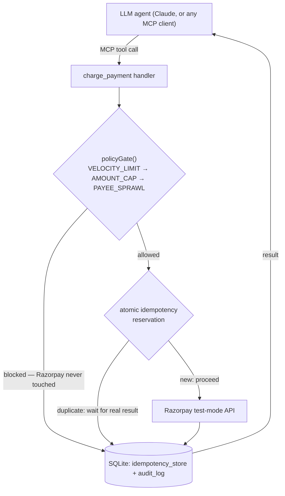

# razorpay-guardrail

**A safety layer for agentic payments that an LLM cannot talk its way
around.**

`razorpay-guardrail` is an [MCP](https://modelcontextprotocol.io) server
that wraps Razorpay's payment API with hard-enforced spending controls,
duplicate-charge protection, and a full audit trail — built for a world
where an LLM agent, not a human, is the one deciding to spend money.

Point any MCP-compatible agent (Claude Desktop, Claude Code, or your own)
at this server, and it gets exactly two tools: create a payment mandate,
and charge against one. Every charge attempt is checked against
configurable spending limits *before* Razorpay is ever contacted — and
that check is not something the agent can choose to skip.

## The problem this solves

The common pattern for "AI safety" in agent tooling is a separate
`check_limits` tool that the agent is *supposed* to call before
`charge_payment`. That's a convention, not a rule — a confused agent, a
bad prompt, or a prompt injection can call `charge_payment` directly and
the check never runs. It exists, but it's optional in practice.

## What's different here

The safety checks are not a tool. There is no `check_spending_limit` tool
to skip, because the check isn't a decision point at all — it's code that
runs unconditionally at the top of `charge_payment`'s own handler, before
a single line of Razorpay-calling code executes. There is no path from
"agent calls charge_payment" to "money moves" that doesn't pass through
the gate first. See [`DEV_DOCS.md`](./DEV_DOCS.md) for the full
architecture writeup, including two real bugs (a concurrency race in the
idempotency logic, and a Razorpay API misunderstanding) that were found
by actually running the thing under load, not just written and assumed
correct.

**In short, what makes this project worth a second look:**
- **Enforcement, not convention** — the gate is unconditional middleware
  inside the tool handler, not an optional tool the LLM can be
  persuaded to skip
- **Real Razorpay integration, not mocked** — every call in this repo is
  a genuine Razorpay test-mode API call, including the ones that reveal
  real-world constraints (see [Known limitations](#known-limitations))
- **Concurrency-safe idempotency** — verified under actual simultaneous
  duplicate calls, not just sequential retries (this is the part most
  "add idempotency" implementations get subtly wrong — see `DEV_DOCS.md` §6)
- **MCP-native** — not tied to one agent framework; anything that speaks
  MCP (Claude, or any other MCP client) gets the same protection for free
- **A full, queryable audit trail from the first tool call**, not bolted
  on afterward

## Architecture



## Tools exposed

| Tool | Purpose | Safety checks |
|---|---|---|
| `create_mandate` | Register an eNACH or UPI Autopay mandate with a payee | None (mandates don't move money by themselves) — every attempt is still audit-logged |
| `charge_payment` | Charge against an existing mandate | Policy gate + idempotency, both mandatory, both run before Razorpay is contacted |

### Policy gate (`charge_payment` only)

Checked in this exact order, configurable via environment variables:

1. **`VELOCITY_LIMIT`** — today's spend for this agent + this charge > `DAILY_CAP` (default `5000`, in paise)
2. **`AMOUNT_CAP`** — this charge alone > `SINGLE_TXN_CAP` (default `2000`, in paise)
3. **`PAYEE_SPRAWL`** — this would be a new distinct payee beyond `MAX_PAYEES` paid today (default `3`)

A blocked call returns a structured refusal and touches nothing else:

```json
{ "allowed": false, "code": "VELOCITY_LIMIT", "reason": "Today's spend (500) + this charge (5001) would exceed the daily cap of 5000" }
```

## Dependencies

| Package | Why |
|---|---|
| [`@modelcontextprotocol/sdk`](https://www.npmjs.com/package/@modelcontextprotocol/sdk) | MCP server + client implementation |
| [`razorpay`](https://www.npmjs.com/package/razorpay) | Official Razorpay Node SDK |
| [`better-sqlite3`](https://www.npmjs.com/package/better-sqlite3) | Synchronous SQLite — no external database needed, and its synchronicity is what makes the idempotency reservation atomic (see `DEV_DOCS.md`) |
| [`zod`](https://www.npmjs.com/package/zod) | Tool input schema validation |
| [`dotenv`](https://www.npmjs.com/package/dotenv) | Loads `.env` |
| `tsx`, `typescript` (dev only) | Run/compile TypeScript directly |

Node.js 20+ (uses `node --import` for running TypeScript without a build
step). No Docker, no external database, no paid services.

## Setup

```bash
npm install
cp .env.example .env
```

Fill in `.env`:

```bash
RAZORPAY_KEY_ID=       # from your Razorpay test-mode dashboard
RAZORPAY_KEY_SECRET=   # from your Razorpay test-mode dashboard
DAILY_CAP=5000         # paise — optional, this is the default
SINGLE_TXN_CAP=2000    # paise — optional, this is the default
MAX_PAYEES=3           # optional, this is the default
DB_PATH=./data/guardrail.db   # optional, this is the default
```

## Usage

**Run the demo** (the fastest way to see it work — no external client
needed):

```bash
npm run demo-attack
```

Spawns its own server instance (identical to how a real MCP client would
launch it) and simulates a misbehaving agent:
- fires an identical charge 5x rapidly → only 1 real Razorpay attempt, the rest served from the deduped result
- attempts a charge over `DAILY_CAP` → blocked, `VELOCITY_LIMIT`, zero Razorpay calls
- attempts charges to more payees than `MAX_PAYEES` allows → blocked on the one that crosses the line, `PAYEE_SPRAWL`
- prints the full audit log so every decision is visible and explainable

**Reset demo state** between runs (clears today's spend/payee tracking
without waiting for a new day or restarting anything):

```bash
npm run reset
```

**Run the server standalone**, to point a real MCP client at it:

```bash
npm start
```

**Connect it to Claude Desktop or Claude Code** — add to Claude Desktop's
`claude_desktop_config.json` (or register via `claude mcp add` for Claude
Code):

```json
{
  "mcpServers": {
    "razorpay-guardrail": {
      "command": "node",
      "args": ["/absolute/path/to/this/repo/dist/src/index.js"],
      "env": {
        "RAZORPAY_KEY_ID": "...",
        "RAZORPAY_KEY_SECRET": "...",
        "DAILY_CAP": "5000",
        "SINGLE_TXN_CAP": "2000",
        "MAX_PAYEES": "3",
        "DB_PATH": "/absolute/path/to/this/repo/data/guardrail.db"
      }
    }
  }
}
```

Run `npm run build` first — Claude Desktop spawns MCP servers outside a
normal shell, so it needs the compiled `dist/` output and absolute paths;
it can't resolve `tsx` or relative paths the way a terminal can. Rebuild
and fully restart Claude Desktop after any source change.

Then, in conversation:

> Use razorpay-guardrail to create a UPI Autopay mandate for payee
> "acme-vendor", amount 1500, purpose "monthly subscription"

> Charge 15000 against that mandate for payee "acme-vendor"

— watch it get blocked by the policy gate before Razorpay is ever
touched, with a clear, structured reason.

## Known limitations

- **A genuinely successful charge requires a customer-authorized
  mandate.** Real eNACH/UPI Autopay charges need a `token_id` that only
  exists after the customer approves the mandate in their bank/UPI
  app — a step that can't be scripted headlessly. `charge_payment` makes
  a real, correctly-shaped call to Razorpay's actual recurring-payment
  endpoint; without an authorized token, Razorpay rejects it with a real
  error, which is surfaced honestly rather than faked into a success.
  This doesn't undermine what's being demonstrated — the policy gate and
  idempotency guarantees hold regardless of whether the underlying charge
  succeeds.
- **`create_mandate` with `method: "emandate"`** currently fails with a
  generic Razorpay server error, reproducible even with Razorpay's own
  documented example values. This has the signature of an account-level
  feature not being activated for this sandbox account, not a code bug.
  **`method: "upi_autopay"` works end to end** and is the recommended
  path for a demo.

## Explicitly out of scope

No anomaly detection or ML, no human-in-the-loop approval flow, no
webhook handling beyond what a test-mode charge needs, no UI/dashboard —
the structured audit log is the observability story for this project.

## License

MIT — see [`LICENSE`](./LICENSE).
