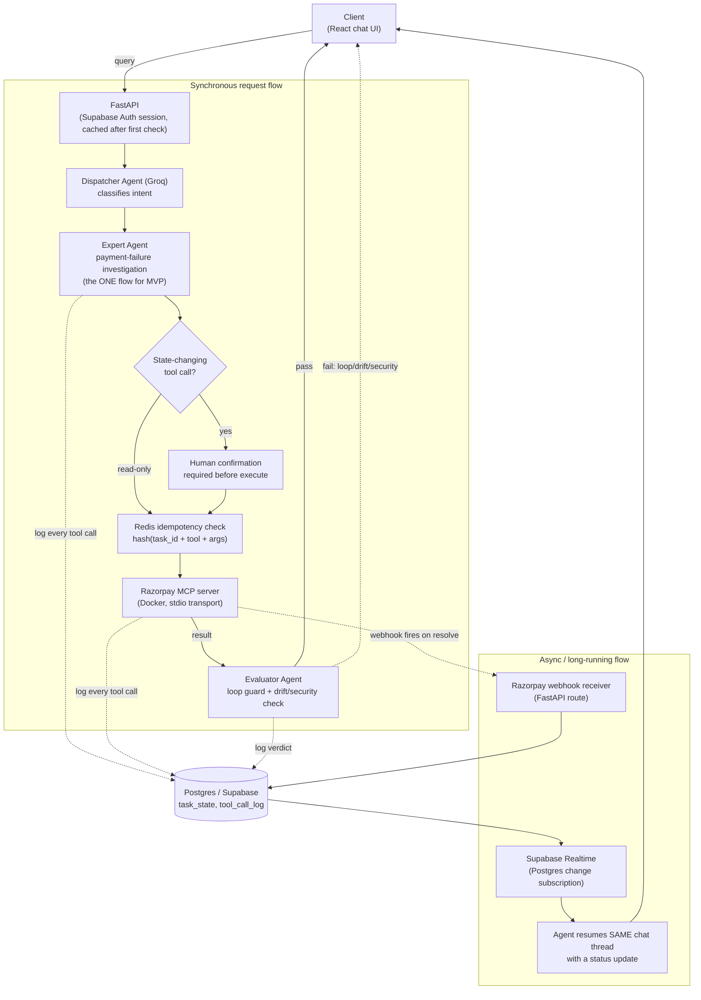

# Yaka — MVP architecture (v2, scoped to buildathon week)

Single flow only: payment-failure investigation. Everything routes through the
Orchestrator — no agent talks to a tool or the DB directly.

## What changed from the v1 sketch, and why

- **One expert agent, not three generic Worker Agents.** MVP scope is a single
  flow (payment-failure investigation). Multiple workers, a company-tools MCP
  hub, and non-company basic tools are a real pattern — just not this week.
- **No agent calls a tool directly.** Every path to the Razorpay MCP server
  goes through the idempotency check (and, for state-changing calls, human
  confirmation) first. In the v1 sketch, Worker Agents and RAG pipelines had
  direct lines to tools and the DB, which meant governance was optional
  instead of guaranteed.
- **Idempotency (Redis) is drawn explicitly**, in front of every tool call —
  it was missing entirely from v1.
- **Human confirmation is a real node on the state-changing path**, not
  implied. Non-negotiable from the project scope: no autonomous financial
  actions.
- **One memory system for now: Postgres.** `task_state` /
  `tool_call_log` is the single source of truth for transaction/task state.
  The v1 sketch had three overlapping memory boxes (Recall Memory, Persistent
  memory segregator, Mem0) — Mem0 is real but it's a last-priority UX layer
  for conversational preferences, never the source of truth, and it's cut
  first if time runs short. It's not in this diagram at all yet.
- **Auth is Supabase, not a custom API Gateway AuthN/AuthZ layer.** Session
  gets cached after the first check so we're not making a network call to
  Supabase on every tool call.
- **No SIEM/alerting platform.** Real pattern, out of scope for zero-cost/1-week.
- **The async flow is drawn as a first-class citizen**, not omitted. Webhook
  → Postgres → Supabase Realtime → resume-the-same-thread is arguably Yaka's
  actual differentiator, so it's on the diagram, not an afterthought.
- **Evaluator sits between the tool result and the response**, not off to the
  side as a peer of the Worker Agents pointing at a separate Conflict
  Condition box. For MVP, "fail" just means the response doesn't go out
  clean — no SIEM escalation needed yet.
